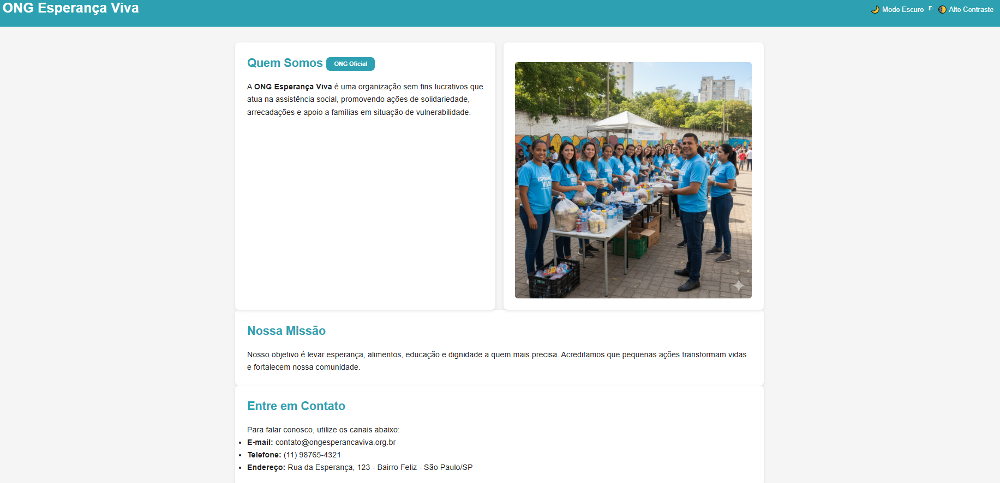

# 🌍 ONG Esperança Viva — Projeto Final (Entrega IV)

🔗 **Acesse o site:** [https://vagnerdevbr.github.io/entrega4-ong-esperanca-viva/](https://vagnerdevbr.github.io/entrega4-ong-esperanca-viva/)



---

## 🧩 Descrição do Projeto
Aplicação SPA (Single Page Application) desenvolvida para a ONG Esperança Viva, com foco em inclusão, acessibilidade e usabilidade.  
O projeto segue as diretrizes **WCAG 2.1 Nível AA** e boas práticas de versionamento com **GitFlow**.

---

## ⚙️ Tecnologias Utilizadas
- HTML5 semântico  
- CSS3 (modularizado e responsivo)  
- JavaScript ES6  
- Git / GitHub  
- GitHub Pages  

---

## 🧭 Estrutura do Projeto

```
css/
js/
img/
dist/ ← arquivos minificados para produção

```

---

## 🚀 Deploy
Arquivos otimizados e minificados estão disponíveis na pasta **/dist**, prontos para deploy em produção.

---

## 🧱 Versionamento
- Estrutura GitFlow aplicada (`main`, `develop`, `feature/*`)
- Commits semânticos
- Release: [v1.0.0](https://github.com/VagnerDevBR/entrega4-ong-esperanca-viva/releases/tag/v1.0.0)

---

## 👩‍🦯 Acessibilidade
- Navegação total por teclado  
- Alto contraste e modo escuro  
- Leitura compatível com leitores de tela  
- Estrutura HTML semântica  

---

## 🧑‍💻 Autor
**Vagner Dev**  
📧 contato: [vagner-v6@live.com]  
🌐 GitHub: [https://github.com/VagnerDevBR](https://github.com/VagnerDevBR)
